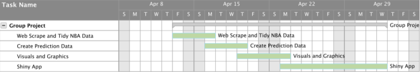

### Introduction

Fantasy sports have been a popular way for fans to get more knowledgeable and interested into the sports they love. Fantasy sports began as board and card games 50 years ago and have exploded since it was introduced to the internet. The appeal to fantasy sports is they allow fans to act as owners, managers and coaches of professional teams by allowing them to draft a team and watch the season unfold successfully or catastrophically. 

One of the most popular fantasy sports people participate in is fantasy basketball for the NBA. The first step when participating in fantasy basketball is drafting a team which usually consists of about thirteen players and there can be restrictions on how many players of each position an individual may draft (This all depends on the specific league one participates in). Once a team has been drafted, the league determines which statistics will be counted as fantasy points and how many fantasy points each statistic is worth. For example, a block counts for 1 fantasy points while a steal counts for 2. After this has been set and the NBA season begins, each night the fantasy points for each participant is totaled and the participant at the end of the regular season with the most fantasy points wins. Therefore, when drafting players one needs to be able to analyze players pasts statistics, predict future player statistics and weigh them based on the determine fantasy point scoring system to draft a team that will make them the optimal amount of points for the season. 

With all the possible statistics to consider (depending on the particular fantasy league one is apart off), we hope to create a tool for fantasy NBA participants to use during their draft to help them make the best possible team selections. This tool ideally would allow a participant to input their individual league scoring system and the players that have already been selected in the draft and return the best possible team they could select based on NBA players statistics in the past five years and predictive modeling. Along with the output of the predicted best team, there will be graphical representations of why the particular players were chosen. 

Our idea stated above matches the course focus on statistical programing because it involves taking a large data set and using a data pipeline in order to use that dataset to make prediction on NBA players future performance based on their past performance (their past statistics). We will also be providing visual representation of the data in the form of graphs which will compare players, as well as, coding a shiny app for fantasy league participants to easily customize the data pipeline to their personal fantasy league rules. 

### Methods

The methodology for our group project will closely follow the analytical data pipelines phases. As we need to import data related to basketball players off the internet we will need to use SelectorGadget as well as the rvest package to scrape this information offline. We plan to import the data from http://www.basketball-reference.com assuming that we have continued success in scraping from that site. Then we will have to tidy the data, so it is likely we will need stringr, rvest, and tidyr. 

Our goal in tidying the data is to have the data organized so that each player’s average score during a year in the NBA is an observation. So, for every year a player has played in the NBA they would have an extra observation. Each observation would contain the name, organization, position, and age of the player. Along with these three factor variables and one-time variable, likely an integer, we will have statistics variables for the average of the season, likely some form of numeric. The desired statistics follow the most widely used statistics in fantasy NBA under the point-based scoring method, where each statistical category counts for a set number of points. The categories likely to be used are points, rebounds, assists, offensive blocks, defensive blocks, steals, fouls, turnovers, field goal percentage, and free throw percentage.

How we plan to model our NBA league will directly impact how we transform the data, so it must be discussed. NBA fantasy can be done many ways, but the way we are going to be analyzing is based on the fantasy points method of NBA fantasy. In this method the group playing sets each statistic to have a point value and the points for your fantasy team are calculated real time. At the end of the season those with more points win. This model seemed the most straight forward in implementing our project. It will also allow for a large amount of user customization when the project is done, as a group of friends can decide how many points each statistic is worth, or if they are worth none. 

Then we must transform the data of into some sort of prediction for the coming years data. This part can be done through time series modeling. We would take every individual player individual statistics and use a time series model to predict how they will perform in that statistic next year. Now we have a new transformed data for each player containing predictions for their average statistics per game next year. We would then allow for user input to give statistics more weight in totaling points. So, the final dataset that we show is our prediction data set multiplied by a vector of user weight inputs, as well as former years averages multiplied by user inputs.

The visualization part concerns how we display this information in graphs, as well as how we display the entire shiny application. At this moment the overall layout for our shiny app consists of a tab for changing settings on one side, a tab for picking players on the other side, and a list of picked players for each team on the bottom. On the side with players we will have rows sorted by players expected total score next year, highest first. These players will descend the page, each player taking up a row. On the players will be a summary of who they are, along with the current years statistics and our predicted statistics. Next to these numbers will be a button that switches to graphs pertaining to this player. By clicking on multiple boxes, we can see different player comparisons. 

Regarding the graphs that we will compose using our data, the graphs are either comparative between players, or analyzing an individual player over time. When comparing players, we will use side by side bar plots with the x axis being source of points and the y axis being amount of points. The bars will be sorted by individual statistic, points with points and assists with assists. This allows direct comparison between the two chosen players to determine who is better at what category, as well as who is better. When analyzing an individual player change throughout time we will use a scatterplot graph with years on the x axis and total points on the y axis. This scatterplot will be accompanied by a best fit regression line to be determined while analyzing the data, although we suspect it to be parabolic with players getting worse with age after they peak. Along with normal points from actual years we will highlight our predicted point, which is the point that our best fit line intersects with next year. We could also implement it where if a user clicks on a predicted or past point they can see a summary of what statistics a player specializes in during any year.

In summation we will have to write code that retrieves the data for current players as well as these players former years. We then must write code that sorts this data into tidy and usable datasets. Then we need to write a time series model that takes players past NBA performances and predicts next years performance. We then must code a shiny interface that takes these predicted and historic point values and displays them along with players name, team, and position. Lastly, our shiny application must have a way to create graphs that explain different players differences as well as the idea behind our prediction.

### Feasibility

We believe that all the goals for this fantasy team selector tool we will be able to create by the end of the semester.  This includes the graphical representations of players current and past statistics, graphical comparisons of players, a shiny app that allows for customizability to different league rules and the selection of a fantasy league team. However, if we do run into complications during the creation process, we may have to scale back the amount of customizability provided in the app in order to complete this project on time. 

In order to complete the project, we must complete the following tasks… 

1.	Web scrape and tidy the NBA statistics data (Anne)

2.	Write code to create prediction data through time series modeling (Conrad)

3.	Visually/Graphically represent the prediction data (Zhaobin)

4.	Create the shiny app (Everyone)

### References

Davis, Nickolas W., and Margaret Carlisle Duncan. "Sports Knowledge   Is Power Reinforcing Masculine Privilege Through Fantasy Sport     League Participation." Journal of Sports and Social Issues 30,     no.   3 (August 1, 2006): 244-46.

Hadley Wickham, Romain Francois, Lionel Henry and
  Kirill Müller (2017). dplyr: A Grammar of Data
  Manipulation. R package version 0.7.4.
  https://CRAN.R-project.org/package=dplyr

H. Wickham. ggplot2: Elegant Graphics for Data
  Analysis. Springer-Verlag New York, 2009.

Hadley Wickham (2016). rvest: Easily Harvest (Scrape)
  Web Pages. R package version 0.3.2.
  https://CRAN.R-project.org/package=rvest

Hadley Wickham (2018). stringr: Simple, Consistent
  Wrappers for Common String Operations. R package
  version 1.3.0.
  https://CRAN.R-project.org/package=stringr

Hadley Wickham and Lionel Henry (2018). tidyr: Easily
  Tidy Data with 'spread()' and 'gather()' Functions. R
  package version 0.8.0.
  https://CRAN.R-project.org/package=tidyr
  
Raney, Arthur A., and Jennings Bryant. 2014. Handbook of Sports and   Media. New York, New York: Routledge, Taylor & Francis Group.

Stefan Milton Bache and Hadley Wickham (2014).
  magrittr: A Forward-Pipe Operator for R. R package
  version 1.5.
  https://CRAN.R-project.org/package=magrittr
  
Winston Chang, Joe Cheng, JJ Allaire, Yihui Xie and
  Jonathan McPherson (2017). shiny: Web Application
  Framework for R. R package version 1.0.5.
  https://CRAN.R-project.org/package=shiny

